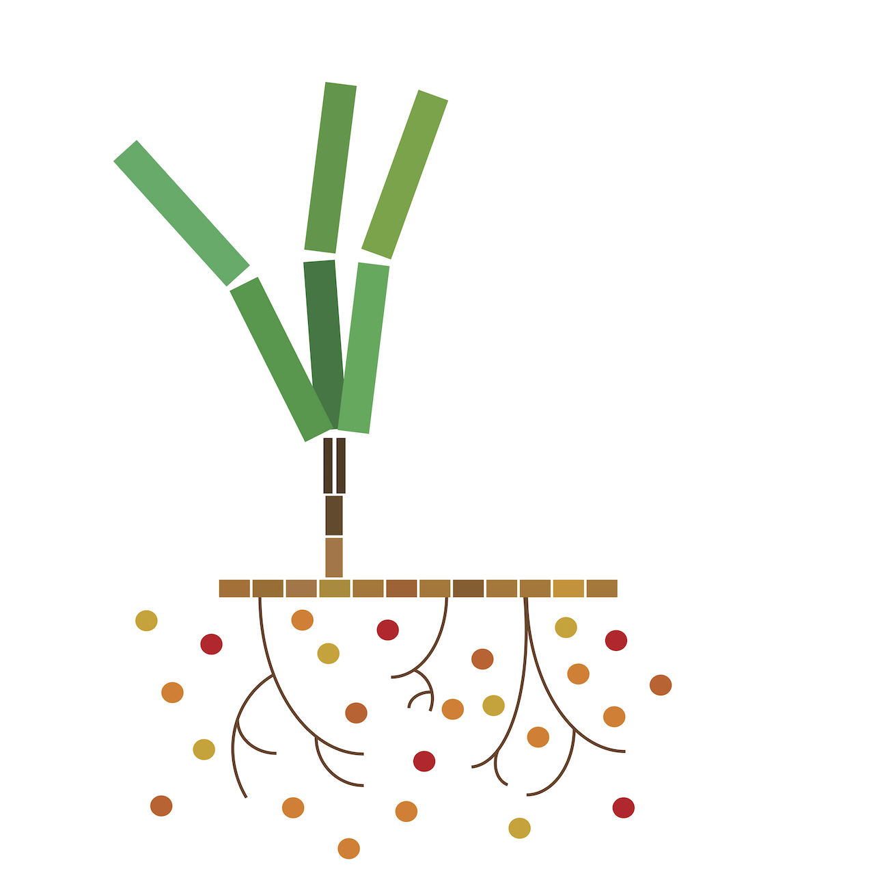

# The ZEN Microbiome Project 

> Ashkaan K Fahimipour

April 11, 2016

### 1. Introduction
The first step in understanding the symbiotic relationship between seagrass microbes and their host is to characterize the baseline microbiota and the differences that are associated with host genotype and environment. In the Moore Foundation proposal, we proposed to address the following set of questions:

- How much is microbial community composition influenced by genetic and ecological variation in the host, and is this different for different host tissues?
- Is there a ‘core microbiome’ or set of commonly occurring microorganisms that appear in all assemblages associated with seagrasses?
- Are there significant co-occurrence or co-exclusion relationships between pairs of microbial taxa within the seagrass microbiome?