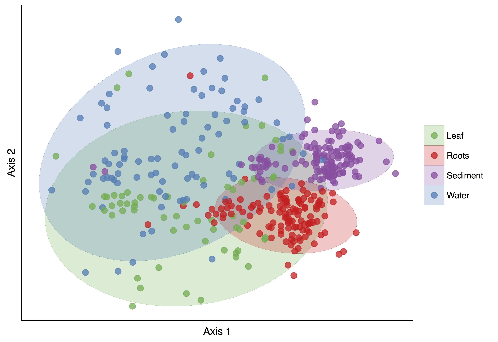
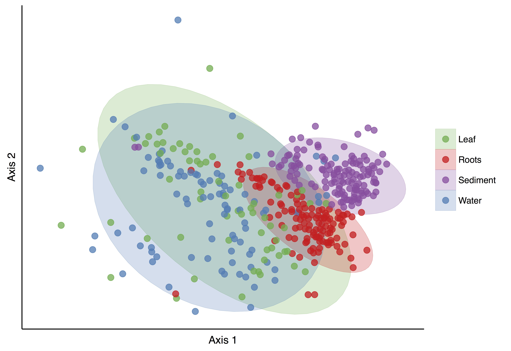
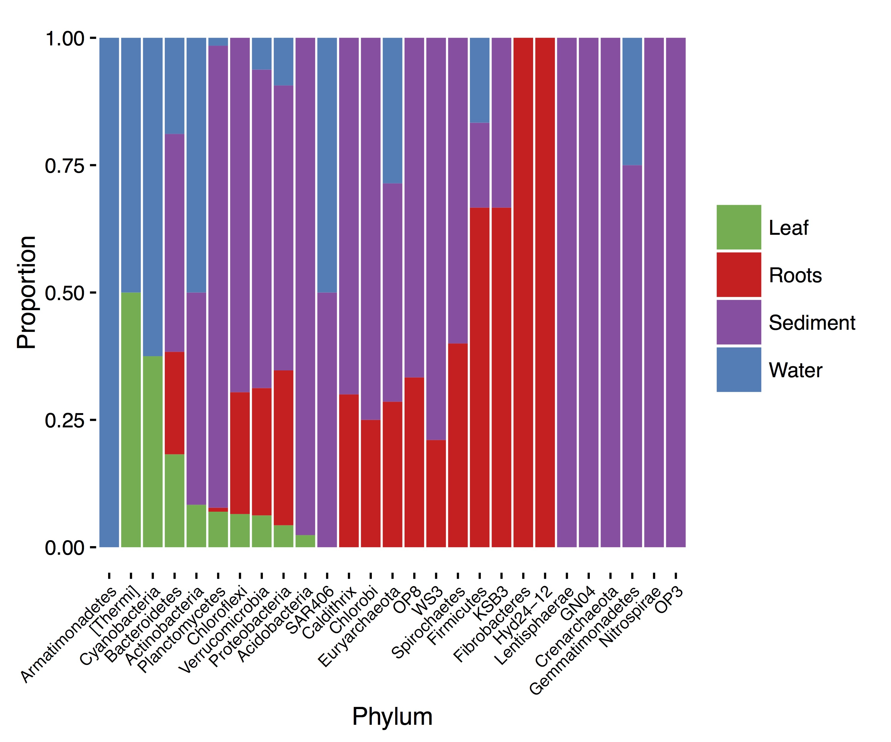
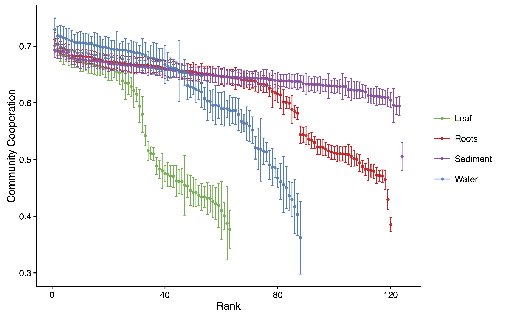
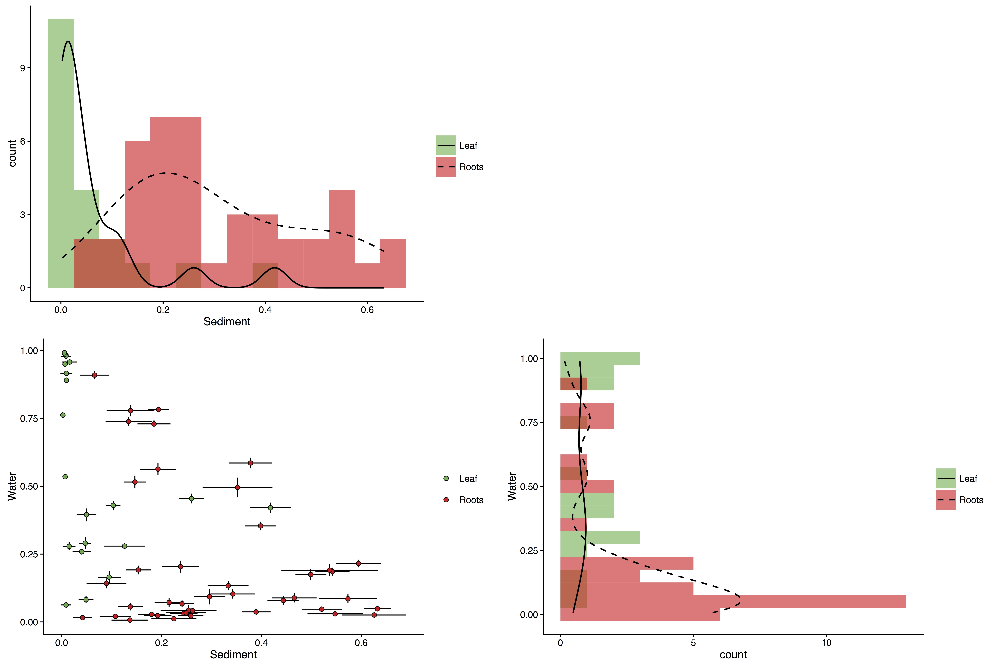

#  The ZEN Microbiome Project

> May 10, 2016

### 1. Introduction 
The first step in understanding the symbiotic relationship between seagrass microbes and their host is to characterize the baseline microbiota and the differences that are associated with host genotype and environment. In the Moore Foundation proposal, we proposed to address the following set of questions:

- Is there a ‘core microbiome’ or set of commonly occurring microorganisms that appear in all assemblages associated with seagrasses?
- How much is microbial community composition influenced by genetic and ecological variation in the host, and is this different for different host tissues?
- Are there significant co-occurrence or co-exclusion relationships between microbial taxa within the seagrass microbiome?

### 2. Brief summary of results
I'm going to outline some results here, and move all the code into a separate folder in this repository over the weekend.

#### 2a. Community Ordination
I want to analyze patterns in microbial community composition among our different sample types (Leaf, Root, Sediment and Water). To do this, I'll calculate Canberra *distances* between community pairs using `cube-root` transformed relative abundances. I'll then visualize these in 2-dimensions using nonmetric multidimensional scaling (NMDS; Fig. 1 left-hand panel). I'll do the same using the unweighted Unifrac metric (right-hand panel).

#### Figure 1
 

The points in Fig. 1 represent microbial communities, colored by sample type. Points that are closer together in NMDS space have more similar bacterial communities, or lower beta-diversity; ellipses represent 95% confidence intervals. The `cube-root` transformation yielded an ordination stress of `0.196`, indicating that an acceptable solution was found.

There is a clear pattern of differentiation among microbial communities found on different parts of the plant and environment. The composition of microbiomes from seagrass roots, soil and ocean water are significantly different (stats), whereas the composition of leaf microbiomes appears to overlap at least in part with all three and strongly with the composition of water communities. Roughly, above- and below-ground microbiomes are separated along the *x*-axis, while the *y*-axis separates plant-associated communities from environmental ones.

The results from the Unifrac ordination look qualitatively similar to the results of the Canberra ordination, which reveals something about the drivers of community composition in the seagrass microbiome. Namely, it suggests that the OTUs that really differ in presence and relative abundance between our four sample types also exhibit a low level of shared phylogenetic branch length on average. If the differences between the four groups were driven primarily by differences in the relative abundance of close relatives, then we would not expect to see such comparable (to Canberra) beta-diversity patterns in NMDS space when the unweighted unifrac metric was applied.

#### Summary of section 2a
I analyzed beta-diversity in community composition using two different metrics: `Canberra`, which computes community dissimilarities using differences in the presence and relative abundance of OTUs and `unweighted Unifrac`, which weighs community dissimilarity based on the phylogenetic distance between OTUs that are present in the system. Because they yield similar beta-diversity patterns, we can conclude that the major differences between microbiomes sampled from different habitats (i.e., leaf, root, water or sediment) were due to differences in the presence and abundance of phylogenetically distinct OTUs. Moreover, these differences were large between soil and root communities but not between water and leaf communities. It is therefore conceivable that different assembly mechanisms operate on the *Z. marina* leaf and root microbiomes. I would like to evaluate this possibility. Do seagrass hosts really *'select'* advantageous bacteria, is their relative abundance directly linked to their availability in the environment and is this different for leaves and roots?

#### 2b. Defining a *'core'* microbiome
Here, I fit generalized linear models with binomial error distributions and logit link functions to the data in order to determine which OTUs were significantly associated with different sample types. I fit a series of models (one for each sample type) as a function of the scaled relative abundance of each OTU using a one-vs-all scheme. I adjusted p-values for multiple comparisons using the Benjamini-Hochberg procedure, and selected the model with a q-value < 0.01 and the largest positive regression coefficient as the strongest association for each OTU. The analysis reveals about 1100 OTUs with non-random habitat associations. This table can be [found here](./output/OTU-associations.txt). I propose that the OTUs significantly associated with Leaf and Root communities comprise their *'core'* microbiomes. Scanning that taxon list, it appears for instance that sulfur metabolism is an important function for the seagrass root microbiome. Fig. 2 shows the relative habitat associations for Phyla detected in our samples.

#### Fig. 2

#### 2c. Metabolic modeling reveals potential ecology
For all OTUs [defining the core microbiome](./output/OTU-associations.txt), I BLASTed their 16s sequences against a database of 16s sequences for all taxa with whole genomes sequenced in the NCBI database. I then downloaded and annotated genomes with at least a 91% sequence similarity (approximately family-level similarity) using modelSEED and generated a topological reaction network for each OTU fulfilling these criteria. I then looked at the potential for cooperation among core OTUs in each sample by computing the fraction of exogenously-acquired compounds (defined in [this paper](http://www.pnas.org/content/110/31/12804.full)) that are synthesized by other members of the community. Fig. 3 shows the mean and standard errors for potential cooperation for all communities. A high degree of variability is visible for the leaves. We should discuss this in person, but I believe it recapitulates a lot of the things we've talked about.

#### Figure 3

#### 2d. Bayesian detection of habitat sources
Results and figures showing that soil is a major source of colonists for roots, but that water contributes little to the composition of root microbiomes on average. Leaves appear to be driven moderately to strongly by Water communities, and weakly by the surrounding soil.

#### Figure 4

