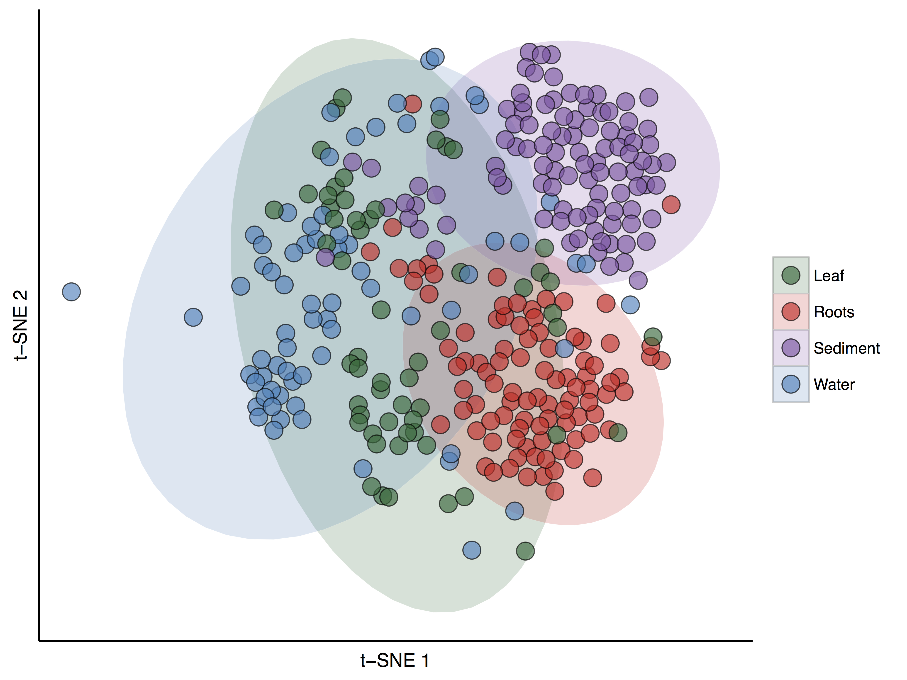
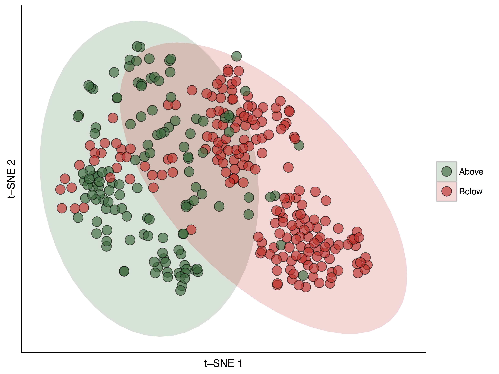
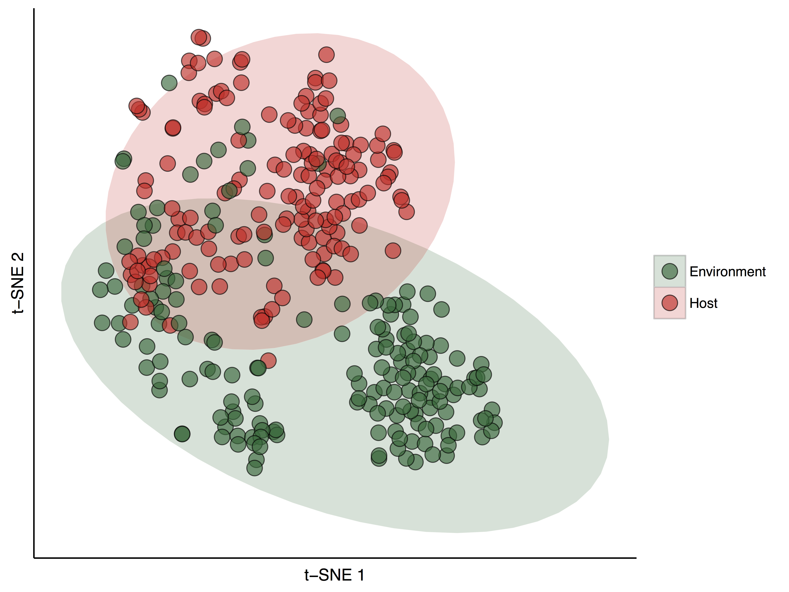
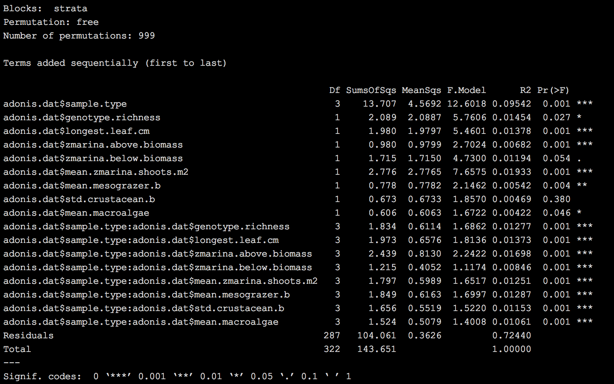
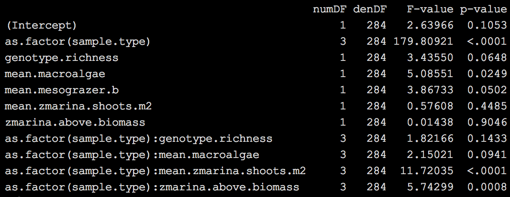
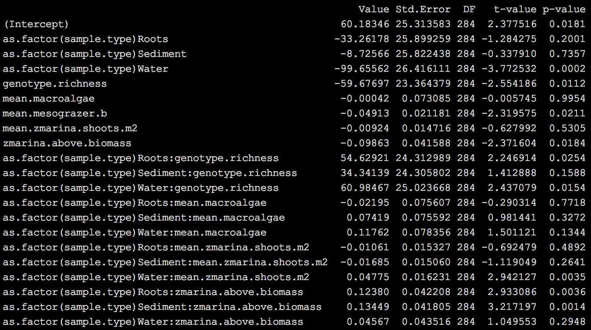
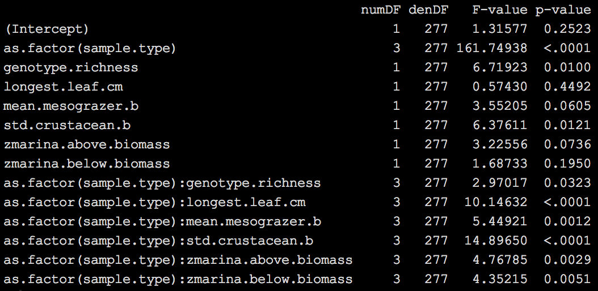
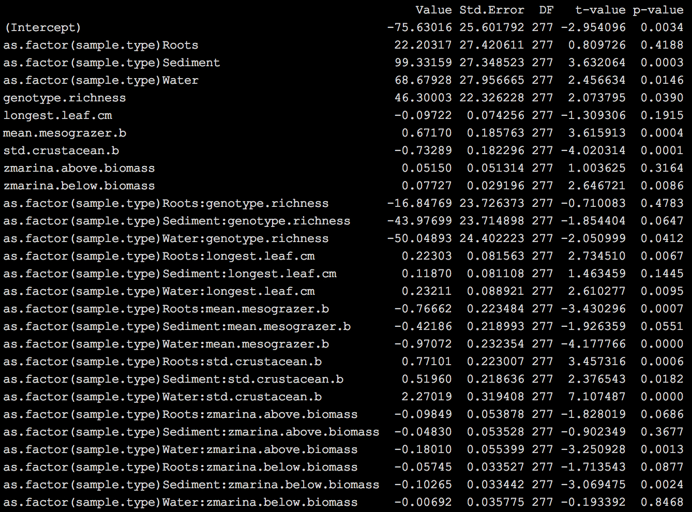

# The ZEN microbiome
#### Ashkaan K Fahimipour
March 7, 2016

## Importing, sorting and cleaning the data

First, let's load a bunch of libraries and functions I've written over the last few months that do various microbiome things. These analyses are performed exclusively in R.

```
setwd('/Users/Ashkaan/Dropbox/')
source('./General Functions/microbiome_functions.R')
set.seed(12345)
```
Let's import all of our data. These data are in the BIOM format, generated from merged libraries using macQIIME 1.9. OTUs were picked against the most recent *greengenes* database at a cutoff similarity of 97%. I rarefied samples to a depth of 100, and normalized OTU read counts by taxon copy number using the PICRUST software. Rarefying to this depth isn't ideal, but yields a decent sample of the data.  I find that the results presented below do not depend on the choice of rarefaction depth up to 500 or whether read counts were corrected for copy number. Since, R has a tough time with HDF5 formatted files, I converted the BIOM table into JSON using *biom convert* in macQIIME prior to these analyses. Contact me for bash scripts that take care of BIOM conversions.

```
## import data
biom <- read_biom('./SMP/data/ZEN_1/97_percent/rarefied_100/otu_table_json_even100_norm_by_copy.biom')
dat <- as.data.frame(as(biom_data(biom), "matrix"), header = TRUE)

## import metadata
tax <- as.matrix(observation_metadata(biom), sep = ',')
meta <- read.csv('./SMP/data/ZEN_1/97_percent/map_for_R.csv')
meta <- as.data.frame(meta)
biotic <- read.csv('./SMP/data/ZEN_biotic_data_2016_01_20.csv', header = TRUE)
```

I want to clean up the OTU table and metadata a little. Most of this is filtering out data that aren't useful to us, and renaming some of the metadata columns.

```
## clean up meta file
meta$SubsiteNumber[which(meta$SubsiteNumber == 1)] <- 'A'
meta$SubsiteNumber[which(meta$SubsiteNumber == 2)] <- 'B'
meta$sub.code <- paste(meta$ZenSite, meta$SubsiteNumber, sep = '.')

## trim taxonomy list to OTUs that are present
tax.trim <- as.matrix(tax[which(rownames(tax) %in% rownames(dat)), ])
tax.2 <- tax.to.long(tax.trim)

## exclude epiphyte samples
dont.use <- meta$SampleID[which(meta$SampleType == 'Epiphyte')]
dat <- dat[, -which(names(dat) %in% dont.use)]

## filter out chloroplasts
chloros <- tax.2$otu[which(tax.2$class == 'Chloroplast')]
dat <- dat[-which(rownames(dat) %in% chloros), ]
```

Finally, the last thing I want to do before analysis is to normalize my BIOM table, and to transform the relative abundances for more well-behaved residuals downstream. I find log(1 + x) and root transforms are good for these sorts of data.

```
## add relative abundances to new biom table
## computing row-wise is so much faster!
dat.rel <- t(t(dat)/rowSums(t(dat)))

## transform data to improve residuals
dat.rel.trans <- log(1 + dat.rel)
```

## 1. Community Ordination
I want to get an initial sense of bacterial community similarity across our different sample types (Leaf, Root, Sediment and Water). To do this, I'm first going to compute Bray-Curtis *distances* of log(1 + x) transformed relative abundances between community pairs. I'll then project these into 2-dimensions using t-distributed stochastic neighbor embedding, or t-SNE. t-SNE is sometimes thought of as a non-linear analogue of nMDS.

```
## distance matrix of transformed relative abundances
dist.metric <- vegdist(t(dat.rel.trans), method = 'bray')
t.sne <- tsne(dist.metric, k = 2, perplexity = 70, initial_dims = NA, max_iter = 1000, whiten = 0)
dist.metric <- as.matrix(dist.metric)

## make a data frame to store our ordination results
tsne.mat = data.frame(t.sne)
rownames(tsne.mat) <- rownames(dist.metric)

## custom script to clean up meta data and rename variables to ones that I like
source('./SMP/code/clean_ZEN_biotic.R')

```
Plotting our results tells us a lot about the structure of these data.

```
colorpal <- c('#006837', '#de2d26', '#8856a7', '#3182bd')
ggplot(data = tsne.mat.na, aes(x = X1, y = X2, fill = as.factor(sample.type))) + 
  stat_ellipse(alpha = 0.2, geom = 'polygon', size = .1, linetype = 1, type = 't', level = 0.95) +
  geom_point(shape = 21, alpha = 0.65, size = 5) +
  theme_bw() + 
  theme(panel.grid.minor = element_blank(), panel.grid.major = element_blank(), 
        panel.border = element_blank(), panel.grid.minor = element_blank(), 
        panel.background = element_blank()) +
  theme(axis.line = element_line(color = 'black')) +
  xlab('t-SNE 1') +
  ylab('t-SNE 2') +
  scale_radius(range = c(1.5, 7.5)) +
  scale_colour_manual(values = colorpal, guide = guide_legend(title = NULL)) +
  scale_fill_manual(values = colorpal, guide = guide_legend(title = NULL)) +
  theme(axis.text.x = element_blank(), axis.text.y = element_blank(),
  	axis.ticks = element_blank())
```

#### Figure 1



The points in Fig. 1 represent bacterial communities, colored by sample type. Points that are closer together in t-SNE space have more similar bacterial communities, or lower beta-diversity. The ellipses represent 95% confidence intervals. The first thing I notice is that there is pretty clear differentiation among bacterial communities found on different parts of the plant and environment. Roughly, the *x*-axis differentiates above- and belowground microbiomes (Fig. 2), while the *y*-axis seperates plant-associated communities from environmental ones (Fig. 3). Moreover, root and sediment microbiomes appear to seperate more than leaves and whole water. Assuming that water and sediment are major sources of colonists for leaves and roots respectively, it would be interesting to know more about this. More on that later.


#### Figure 2



#### Figure 3



### 1a. Permutational MANOVA
Something we might want to know right away is whether any of the (a)biotic variables measured by the ZEN team correlate with axes scores from our community ordination. There are a couple of ways to do this. One is with a PERMANOVA test. Although I think there are some limitations associated with this type of analysis, it could give us some intuition about the data. I'll rely on the *adonis* function in the *vegan* package for PERMANOVAs. First we need to merge our metadata with our OTU table. To pare down the number of possible covariates in our analysis, I performed a quick PCA on the metadata, and selected variables that loaded on the first 3 components.

```
pca.all <- princomp(tsne.mat.na[, c(10:14, 16:45)])
loadings(pca.all)
```

The first 3 components load onto 7 variables. These are:

1. Longest Leaf (cm)
2. *Z. marina* above ground biomass
3. *Z. marina* below ground biomass
4. Mean *Z. marina* shoots density
5. Mean mesograzer biomass
6. Mean macroalgae biomass
7. Standardized crustacean biomass

We'll be including these in our PERMANOVA along with latitude, longitude and site ID...

```
## first add sample types to transposed biom table
adonis.dat <- as.data.frame(t(dat.rel.trans))
adonis.dat$sample.type <- rep(0)
adonis.dat$site <- rep(0)
adonis.dat$lat <- rep(0)
adonis.dat$lon <- rep(0)
adonis.dat$longest.leaf.cm <- rep(0)
adonis.dat$zmarina.above.biomass <- rep(0)
adonis.dat$zmarina.below.biomass <- rep(0)
adonis.dat$mean.zmarina.shoots.m2 <- rep(0)
adonis.dat$mean.mesograzer.b <- rep(0)
adonis.dat$std.crustacean.b <- rep(0)
adonis.dat$mean.macroalgae <- rep(0)
```

Now, let's loop through sites to make sure everyone gets matched with their proper metadata.

```

## for loop
for(q in 1:length(rownames(adonis.dat))){
  curr.site <- as.character(rownames(adonis.dat)[q])
  curr.dat <- subset(tsne.mat.na, rownames(tsne.mat.na) == curr.site)
  adonis.dat$sample.type[q] <- as.character(curr.dat$sample.type[1])
  adonis.dat$site[q] <- as.character(curr.dat$site[1])
  adonis.dat$lat[q] <- as.numeric(as.character(curr.dat$lat[1]))
  adonis.dat$lon[q] <- as.numeric(as.character(curr.dat$lon[1]))
  adonis.dat$longest.leaf.cm[q] <- as.numeric(curr.dat$longest.leaf.cm[1])
  adonis.dat$zmarina.above.biomass[q] <- as.numeric(curr.dat$zmarina.above.biomass[1])
  adonis.dat$zmarina.below.biomass[q] <- as.numeric(curr.dat$zmarina.below.biomass[1])
  adonis.dat$mean.zmarina.shoots.m2[q] <- as.numeric(curr.dat$mean.zmarina.shoots.m2[1])
  adonis.dat$mean.mesograzer.b[q] <- as.numeric(curr.dat$mean.mesograzer.b[1])
  adonis.dat$std.crustacean.b[q] <- as.numeric(curr.dat$std.crustacean.b[1])
  adonis.dat$mean.macroalgae[q] <- as.numeric(curr.dat$mean.macroalgae[1])
  if(q == 1){bar.vec <- c(na.omit(seq(1:length(rownames(adonis.dat)))[1:length(rownames(adonis.dat)) * round(length(rownames(adonis.dat)) / 10)]))
             cat('|')}
  if(q %in% bar.vec == TRUE){cat('=====|')}
}
adonis.dat <- na.omit(adonis.dat)

```

Now that our data are in the right format, let's actually perform the PERMANOVA. I'm going to limit interactions in our model to *sample type* by *variable* interactions, since that is of primary interest right now; i.e., we want to know how community composition depends on some linear combination of covariates, and how these relationships change with *sample type*. We're going to constrain permutations to within sites by passing the *site* variable to the *strata* argument.


```
ad.mod <- adonis(adonis.dat[, -c(as.numeric(ncol(adonis.dat) - 11):as.numeric(ncol(adonis.dat)))] ~ 
                   adonis.dat$sample.type * adonis.dat$genotype.richness +
                     adonis.dat$sample.type * adonis.dat$longest.leaf.cm +
                     adonis.dat$sample.type * adonis.dat$zmarina.above.biomass +
                     adonis.dat$sample.type * adonis.dat$zmarina.below.biomass +
                     adonis.dat$sample.type * adonis.dat$mean.zmarina.shoots.m2 +
                     adonis.dat$sample.type * adonis.dat$mean.mesograzer.b +
                     adonis.dat$sample.type * adonis.dat$std.crustacean.b +
                     adonis.dat$sample.type * adonis.dat$mean.macroalgae, 
                 method = 'bray', strata = adonis.dat$site, nperm = 999)
ad.mod

```



### Interpretation
A lot of covariates are significantly correlated with community composition; essentially all of them except *crustacean biomass* are correlated with community composition in all bacterial samples. A plurality of the variation is explained by *sample type* (~10%). While highly significant, the other covariates explain less than 30% of the variation in the data. We can also see that microbiomes of different *sample types* are correlated to these data in different ways (i.e., *sample type by x* interactions ). But, the PERMANOVA framework doesn't permit any sort of post-hoc analyses to tell us *how* they differ. For this reason, I'll take an alternative approach similar to Kembel et al. (2011) PNAS and look for correlations between these data and axes scores resulting from t-SNE ordination of microbial community compositions.
 
### 1b. Linear models vs. axes scores
Another way to explore the relationships between covariates and community compositions are to regress our covariates directly onto our axes scores from the t-SNE. Since there is a reasonable expectation that communities within the same site are non-independent, I will fit a Maximum Likelihood random intercept model using the *nlme* package.

```
library(nlme)

## 1st axis
mod.x1 <- lme(X1 ~ 
                as.factor(sample.type) * genotype.richness +
                as.factor(sample.type) * longest.leaf.cm +
                as.factor(sample.type) * zmarina.above.biomass +
                as.factor(sample.type) * zmarina.below.biomass +
                as.factor(sample.type) * mean.zmarina.shoots.m2 +
                as.factor(sample.type) * mean.mesograzer.b +
                as.factor(sample.type) * std.crustacean.b +
                as.factor(sample.type) * mean.macroalgae,
              random = ~1|site, data = tsne.mat.na, na.action = 'na.fail', method = 'ML')
```

This is our *global model* from which I will perform model selection. To do this, I'll compute *AIC* scores for every possible combination of covariates and interactions and select the model with the lowest *AIC* score. I'll automate this process with the *dredge* function in the *MuMIn* library. The best fit model is reported below.

```
## model selection
dredge.x1 <- dredge(mod.x1, trace = 2)
best.mod.x1 <- get.models(dredge.x1, 1)[[1]]
anova(best.mod.x1)
summary(best.mod.x1)

```

### Ordination *X*-axis


Ordination scores on t-SNE axis 1 are correlated with *sample type* and *mean macroalgae biomass*. There are also significant *sample type* by *above-ground biomass* and *mean shoot density* interactions, indicating that these were correlated with communities from different *sample types* in different ways. Let's explore the model results a bit closer.



*Z. marina* shoot density was related to water microbiomes, only. It also looks like *Z. marina* above ground biomass is significantly correlated with underground microbiome composition - both sediment and root samples. We'll keep all of this in mind as we continue to explore the data.

### Ordination *Y*-axis
I'll repeat the same thing for the 2nd t-SNE axis.

```
## 2nd axis
mod.x1 <- lme(X2 ~ 
                as.factor(sample.type) * genotype.richness +
                as.factor(sample.type) * longest.leaf.cm +
                as.factor(sample.type) * zmarina.above.biomass +
                as.factor(sample.type) * zmarina.below.biomass +
                as.factor(sample.type) * mean.zmarina.shoots.m2 +
                as.factor(sample.type) * mean.mesograzer.b +
                as.factor(sample.type) * std.crustacean.b +
                as.factor(sample.type) * mean.macroalgae,
              random = ~1|site, data = tsne.mat.na, na.action = 'na.fail', method = 'ML')
              
## model selection
dredge.x2 <- dredge(mod.x2, trace = 2)
best.mod.x2 <- get.models(dredge.x2, 1)[[1]]
anova(best.mod.x2)
summary(best.mod.x2)
```


Taking a closer look...



The overall result is that lots of our (a)biotic data are correlated with microbiome community composition. Namely, features of *Z. marina* leaf morphology, biomass and the animal community are significantly correlated with microbiome composition, perhaps suggesting that common drivers influence the microbial, macroscopic plant and animal communities in similar ways. 

## 2. Are there host- or environment-associated taxa?
So far we've determined that microbiomes from different sample types exhibit different community compositions. I would like to know if this is a potential result of strong shifts in who-is-there, e.g., if there are particular taxa associated with different habitats. I would also like to know why all communities overlap a bit in composition, and whether there are cosmopolitan bacteria that are present everywhere. Since routine *ANOVA* is fairly robust to heteroskedacticity, it is a good candidate for identifying taxa that are significantly enriched in particular habitats. First, I'll logit(0.005 + *x*) transform OTU abundances, and perform *ANOVA* tests to determine which OTUs have significantly higher abundances on the host versus the environment.

```
## enriched taxa
logitTransform <- function(p) { log(p/(1-p)) }
enrich.dat <- adonis.dat

## drop OTUs appearing in < 10 sites for being underpowered
if(length(which(colSums(enrich.dat != 0) < 10)) > 0){
  enrich.dat <- enrich.dat[, -c(which(colSums(enrich.dat != 0) < 10))] ## removes sites with less than k reads
}

enrich.frame <- data.frame('otu' = names(enrich.dat[, -c((ncol(enrich.dat) - 14):ncol(enrich.dat))]), 'coef' = rep(NA), 'p' = rep(NA), 'effect' = rep(NA))
for(u in 1:(ncol(enrich.dat) - 14)){
  tryCatch({
    enrich.dat$aov.otu <- logitTransform(0.005 + enrich.dat[, u])
    enrich.frame$otu[u] <- names(enrich.dat)[u]
    temp.mod <- lm(aov.otu ~ as.factor(host.env), data = enrich.dat)
    sig <- which(summary(temp.mod)$coefficients[, 4] <= 0.05)
    enrich.frame$p[u] <- summary(temp.mod)$coefficients[2, 4]
    enrich.frame$coef[u] <- summary(temp.mod)$coefficients[2, 1]
    enrich.frame$effect[u] <- names(summary(temp.mod)$coefficients[, 4])[2]
  }, error = function(e){})
  if(u == 1){bar.vec <- c(na.omit(seq(1:(ncol(enrich.dat)))[1:(ncol(enrich.dat)) * round((ncol(enrich.dat)) / 10)]))
             cat('|')}
  if(u %in% bar.vec == TRUE){cat('=====|')}
}
```

Then, I'll adjust the p-values for multiple comparisons using the Benjamini-Hochberg procedure, and filter the table to include only taxa that are significantly enriched or depressed on the host.

```
enrich.frame <- na.omit(enrich.frame)
enrich.frame$p.adjust <- p.adjust(enrich.frame$p, method = 'fdr')
enrich.frame <- subset(enrich.frame, p.adjust <= 0.01)
```

There are 179 OTUs (out of more than 4100) that are either significantly enriched or depressed on the seagrass host. Tables describing *host-associated* OTUs can be found [here](./output/host_associated_otus.txt), while *environmental* OTUs can be found [here](./output/env_associated_otus.txt). It would be neat to know if host-associated OTUs share any particular functions. This might be possible with PICRUST, although we ought to interpret results with caution. Just scanning the taxa, it appears many of the host-associated microbes are involved in sulfur metabolism. The 84 host-associated OTUs are represented by 28 unique taxonomic orders and 17 classes, suggesting a fairly diverse potential core seagrass microbiome. The 95 taxa that are significantly depressed on seagrass hosts span 23 unique orders and 18 classes. The remaining ~4000 OTUs detected by our methods are probably transient colonists or marine habitat generalists that can tolerate conditions on both the host and in the environment.

## 2a. Visualizing host- and environment-associated microbes with association networks
Let's visualize the microbiomes of leaves, roots, sediment and water using association networks. Here, the network nodes represent OTUs, and the edges are defined as significant correlations between taxa abundances. Because we are dealing with compositional data, I will compute correlations using the renormalization and bootstrapping procedure described by [Faust et al. (2012)](http://journals.plos.org/ploscompbiol/article?id=10.1371/journal.pcbi.1002606). I'll be coloring the nodes according to their classifications (either host- or environment-associated) ascribed in the previous section. The size of the node will be proportional to its degree. And, the edge width will be proportional to the strength of correlation.

First, let's subset our original BIOM table for taxa that are present in at least 10 samples. This is to avoid underpowered correlations among rare taxa.

```
## Use samples with good metadata
use <- rownames(tsne.mat.na)
sub.dat <- dat[, which(names(dat) %in% use)]
sub.dat <- sub.dat[-which(rowSums(sub.dat != 0) < 10), ] ## removes OTUs that occur in less than 10 sites

## Add relative abundances to new biom table
sub.dat.rel <- t(t(sub.dat)/rowSums(t(sub.dat)))
t.sub <- t(sub.dat) ## keep transposed matrix for covariance matrix estimation
```

Now let's ReBoot it!

```
## ReBoot procedure for Spearman correlation networks
out.spear <- ccrepe(x = t(sub.dat.rel), iterations = 1000, sim.score = cor, sim.score.args = list(method = 'spearman'), min.subj = 2, verbose = TRUE)
spear.q <- out.spear$q.values
spear.c <- out.spear$sim.score
diag(spear.q) <- 0
diag(spear.c) <- 0
```

And subset our correlation matrix for those with q-values < 0.01.

```
## Remove non-significant correlations and significant correlations
merged.dat <- spear.c
merged.dat[which(spear.q > 1e-2)] <- 0 ## significant correlations
diag(merged.dat) <- 0
```
I'll be using the *igraph* package for network visualizations. First step is to convert our weighted adjacency matrix into an undirected *igraph* object.

```
## Create igraph object from inferred network
merged <- graph.adjacency(merged.dat, weighted = TRUE, mode = "undirected")
```
Now I'll make the network pretty. This involves changing edge widths, node sizes, etc. and coloring the nodes based on categories we assigned in the previous section.

```
## edge curve and color
curves <- autocurve.edges2(merged)
E(merged)$color <- rep('#31a354', length(E(merged)))
E(merged)$color[which(E(merged)$weight < 0)] <- '#de2d26'
E(merged)$weight <- 7.5 * E(merged)$weight

## node size
V(merged)$size <- degree(merged)^(1/2)

## layout
merged$layout <- layout.fruchterman.reingold(merged)
```
I'm going to color host-associated nodes orange, environmental nodes blue and everything else gray.

```
## add host/env labels
V(merged)$color <- rep('gray50')
V(merged)$color[which(names(V(merged)) %in% host.frame$otu)] <- '#d95f0e' ## orange
V(merged)$color[which(names(V(merged)) %in% env.frame$otu)] <- '#3182bd' ## blue
```

If you want to know the modularity of the network...

```
## (1) Clauset-Newman-Moore algorithm
clust <- fastgreedy.community(merged, weights = abs(E(merged)$weight))
modularity(merged, clust$membership, weights = abs(E(merged)$weight))
```

Let's visualize our speculative meta-network:

```
## meta-network plot
plot.igraph(merged, vertex.label = NA, edge.width = .6*(abs(E(merged)$weight)), edge.curved = curves)
```


The structure of our meta-microbiome is really interesting! It appears to be highly modular, with subsets of OTUs being associated with many OTUs within their sub-communities and few OTUs in other sub-communities (modularity = 0.72 using the Newman-Clauset-Moore algorithm). Moreover, there appears to be a single host-associated community (orange cluster) and two distinct environmental communities (blue clusters). Their also appears to be a single community of ubiquitous taxa that we could not ascribe to either host or environment (gray cluster). The really neat thing is the presence of all of those negative (red) edges between communities, suggesting strong co-exclusion patterns between subsets of these OTUs associated with different habitats.

Let's now get a picture of the differences (and similarities) between our 4 tissue types by visualizing the type-specific association networks for each of these sample types. I'll do this by simply aggregating taxa that are present in each sample type and plotting all the edges between them. Starting with leaves...

```
## subset network by tissue type
type.i.want <- 'Leaf'
type.dat <- meta.to.type(merged.dat, type = type.i.want)

## remove zero-degree nodes
type.dat <- type.dat[, -which(colSums(type.dat) == 0)]
type.dat <- type.dat[-which(rowSums(type.dat) == 0), ]

## make igraph object
type.graph <- graph.adjacency(type.dat, weighted = TRUE, mode = 'undirected') ## let's try undirected for now

## add host/env labels
V(type.graph)$color <- rep('gray50')
V(type.graph)$color[which(names(V(type.graph)) %in% host.frame$otu)] <- '#d95f0e' ## orange
V(type.graph)$color[which(names(V(type.graph)) %in% env.frame$otu)] <- '#3182bd' ## blue

## add to metadata
curves <- autocurve.edges2(type.graph)
E(type.graph)$color <- rep('#31a354', length(E(type.graph)))
E(type.graph)$color[which(E(type.graph)$weight < 0)] <- '#de2d26'
E(type.graph)$weight <- 7.5 * E(type.graph)$weight

## size
# V(type.graph)$size <- degree(type.graph)^(1/2)
V(type.graph)$label.cex <- .5
```

In this graph, I want to scale the size of my nodes with their average abundance across all samples.

```
## i want to size nodes based on their prevalence across samples
for(y in 1:length(names(V(type.graph)))){
  curr.node <- names(V(type.graph))[y]
  curr.dat <- sub.dat.rel[curr.node, ]
#   V(type.graph)$size[y] <- length(curr.dat[which(curr.dat > 0)]) / 20
  V(type.graph)$size[y] <- 12 * (mean(curr.dat)^(1/3))
}
```

Out of curiosity, what OTU has the highest average abundance?

```
## taxon with highest average abundance
tax.2[which(tax.2$otu == names(which(rowMeans(sub.dat.rel) == max(rowMeans(sub.dat.rel))))), ]
```
It happens to be a cyanobateria in the order *Nostocales*. This taxon has the highest average relative abundance, by far. We should do some digging and verify that this isn't a common misclassification for Chloroplasts or something.

Let's visualize the leaf graph now.

```
## add taxonomy if you want to color or label nodes by taxon
for(m in 1:length(names(V(type.graph)))){
  V(type.graph)$phylum[m] <- tax.2$phylum[which(tax.2$otu == names(V(type.graph))[m])]
  V(type.graph)$order[m] <- tax.2$order[which(tax.2$otu == names(V(type.graph))[m])]
  V(type.graph)$class[m] <- tax.2$class[which(tax.2$otu == names(V(type.graph))[m])]
  cat(round(m/length(names(V(type.graph)))*100, 1), '% done matching OTUs to taxa\n')
}

## layout
type.graph$layout <- layout.fruchterman.reingold(type.graph)

## (1) Clauset-Newman-Moore algorithm
clust <- fastgreedy.community(type.graph, weights = abs(E(type.graph)$weight))
modularity(type.graph, clust$membership, weights = abs(E(type.graph)$weight))

## Site-level network plot
plot.igraph(type.graph, vertex.label = V(type.graph)$order, edge.curved = curves)
```


The root network:


Just examining the two graphs visually, it looks like one major difference between root and leaf microbiomes is the absence of that second *environmentally-associated* cluster of strongly co-occurring OTUs in roots.

