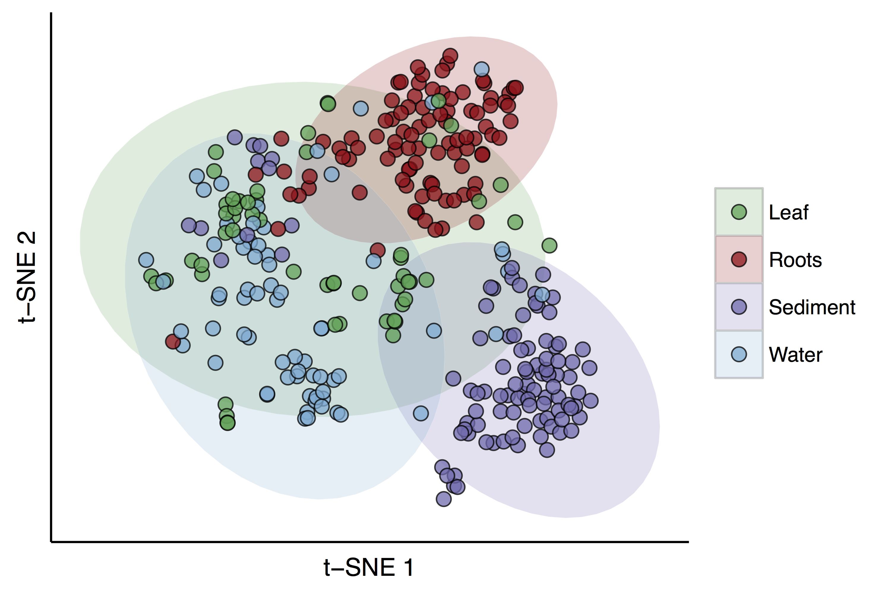
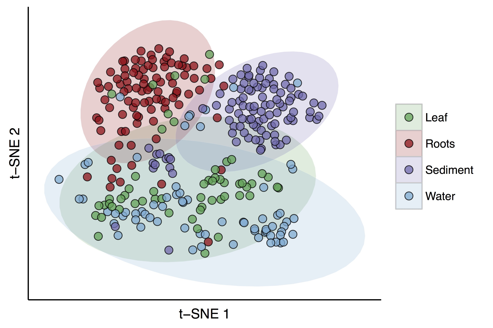
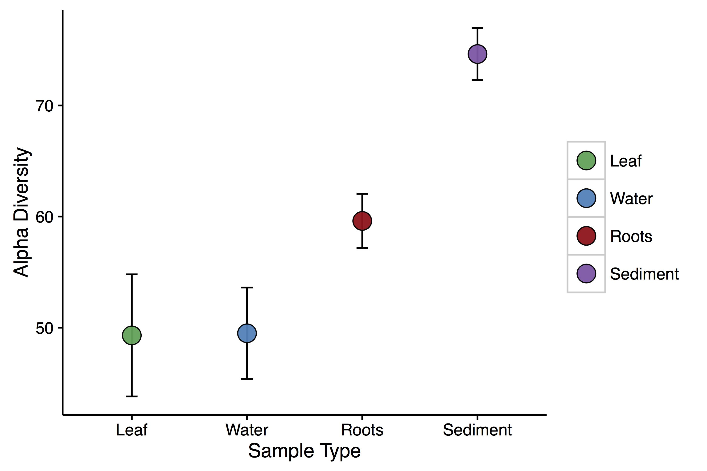

# The ZEN microbiome
#### Ashkaan K Fahimipour
March 27, 2016

### 1. Introduction
The first step in understanding the symbiotic relationship between seagrass microbes and their host is to characterize the baseline microbiota and the differences that are associated with host genotype and environment. In the Moore Foundation proposal, we proposed to address the following set of questions:

- How much is microbial community composition influenced by genetic and ecological variation in the host, and is this different for different host tissues?
- Is there a ‘core microbiome’ or set of commonly occurring microorganisms that appear in all assemblages associated with seagrasses?
- Are there significant co-occurrence or co-exclusion relationships between pairs of microbial taxa within the seagrass microbiome?


### 2. Analyses
These analyses depend heavily on Python scripts bundled with [*macQIIME* v1.9](http://www.wernerlab.org/software/macqiime) and the *biom*, *ggplot2*, *vegan*, *tsne*, *igraph* and *ccrepe* packages in the statistical programming environment *R*.

#### Importing, sorting and cleaning the data

Let's import all of our data. These data are in the *BIOM* format, generated from [these](https://figshare.com/articles/Seagrass_Microbiome/1598220) libraries using *QIIME* 1.9. OTUs were picked against the most recent *GreenGenes* database at a cutoff similarity of 97%. I rarefied samples to a depth of 100, and normalized OTU read counts by taxon copy number using *PICRUSt*. Rarefying to this depth isn't ideal, but yields a fair sample of the data. Since, R has a tough time with HDF5 formatted files, I converted the BIOM table into JSON using [*biom convert*](http://biom-format.org/documentation/biom_conversion.html) prior to these analyses. Bash scripts that generated data are a modified version of James Meadows' scripts found [here](https://github.com/jfmeadow/ReproducibleDemo/blob/master/QIIME/pickTheseOTUs.sh); these are updated to work with *QIIME* 1.9 and tweaked to do some extra bits like filtering out chloroplasts/mitochondria.

I'll load a bunch of libraries and functions I've written in R over the last few months that automate various useful microbiome things and data reshaping.

```r
setwd('/Users/Ashkaan/Dropbox/')
source('./General Functions/microbiome_functions.R')
set.seed(11111)
```

Reading in the data...

```r
## import data
biom <- read_biom('./ZEN-microbiome/data/otu_table_filt_rare100_JSON_copynum.biom')
dat <- as.data.frame(as(biom_data(biom), "matrix"), header = TRUE)

## import metadata
tax <- as.matrix(observation_metadata(biom), sep = ',')
meta <- read.csv('./SMP/data/ZEN_1/97_percent/map_for_R.csv')
meta <- as.data.frame(meta)
biotic <- read.csv('./SMP/data/ZEN_biotic_data_2016_01_20.csv', header = TRUE)
```

I want to clean up the OTU table and metadata a little. Most of this is filtering out data that aren't useful to us, and renaming some of the metadata columns.

```r
## recode subsite from 1-2 to A-B
meta$SubsiteNumber[which(meta$SubsiteNumber == 1)] <- 'A'
meta$SubsiteNumber[which(meta$SubsiteNumber == 2)] <- 'B'
meta$sub.code <- paste(meta$ZenSite, meta$SubsiteNumber, sep = '.')

## trim taxonomy list to OTUs that are present
tax.trim <- as.matrix(tax[which(rownames(tax) %in% rownames(dat)), ])

## string split and unlist
tax.2 <- tax.to.long(tax.trim)

## exclude epiphyte samples
dont.use <- meta$SampleID[which(meta$SampleType == 'Epiphyte')]
dat <- dat[, -which(names(dat) %in% dont.use)]
```

Finally, the last thing I want to do before analysis is to normalize my BIOM table.

```r
## add relative abundances to new biom table
## computing row-wise is so much faster!
dat.rel <- t(t(dat)/rowSums(t(dat)))
```

#### 2a. Community Ordination
I want to get an initial sense of bacterial community composition across our different sample types (Leaf, Root, Sediment and Water). To do this, I'm first going to compute Bray-Curtis *distances* of `log 1 + x` transformed relative abundances between community pairs. I'll then visualize these in 2-dimensions using t-distributed stochastic neighbor embedding, or t-SNE. t-SNE is sometimes thought of as a non-linear analogue of nMDS. In contrast to, e.g., PCA, t-SNE has a non-convex objective function that's minimized using a gradient descent optimization that is initiated randomly. As a result, it is possible that different runs give you different solutions. The authors suggest running t-SNE a number of times, and selecting the visualization with the lowest value of the objective function as the final visualization, which is what I've done here.

```r
## compute distance matrix
dist.metric <- vegdist(t(dat.rel), method = 'bray')

## ordinate w/ t-SNE
t.sne <- tsne(dist.metric, k = 2, perplexity = 50, initial_dims = NA, max_iter = 1000, whiten = 0)

## convert to matrix object for downstream analyses
dist.metric <- as.matrix(dist.metric)

## make a data frame to store our ordination results
tsne.mat = data.frame(t.sne)
rownames(tsne.mat) <- rownames(dist.metric)

## custom script to clean up metadata and rename variables to my preferred syntax
source('./SMP/code/clean_ZEN_biotic.R')

```
Plotting our results tells us a lot about the structure of these data.

```r
colorpal <- c('#006837', '#de2d26', '#8856a7', '#3182bd')
ggplot(data = tsne.mat.na, aes(x = X1, y = X2, fill = as.factor(sample.type))) + 
  stat_ellipse(alpha = 0.2, geom = 'polygon', size = .1, linetype = 1, type = 't', level = 0.95) +
  geom_point(shape = 21, alpha = 0.75, size = 3) +
  theme_bw() + 
  theme(panel.grid.minor = element_blank(), panel.grid.major = element_blank(), 
        panel.border = element_blank(), panel.grid.minor = element_blank(), 
        panel.background = element_blank()) +
  theme(axis.line = element_line(color = 'black')) +
  xlab('t-SNE 1') +
  ylab('t-SNE 2') +
  scale_radius(range = c(1.5, 7.5)) +
  scale_colour_manual(values = colorpal, guide = guide_legend(title = NULL)) +
  scale_fill_manual(values = colorpal, guide = guide_legend(title = NULL)) +
  theme(axis.text.x = element_blank(), axis.text.y = element_blank(),
  	axis.ticks = element_blank())
```

#### Figure 1



The points in Fig. 1 represent bacterial communities, colored by sample type. Points that are closer together in t-SNE space have more similar bacterial communities, or lower beta-diversity. The ellipses represent 95% confidence intervals. The first thing I notice is that there is a clear pattern of differentiation among bacterial communities found on different parts of the plant and environment. Roughly, the *x*-axis differentiates above- and belowground microbiomes (Fig. 2), while the *y*-axis seperates plant-associated communities from environmental ones (Fig. 3). Moreover, root and sediment microbiomes have higher beta-diversity than do leaves and water. Assuming that water and sediment are the major sources of colonists for leaves and roots respectively, this would be worth exploring further. It *hints* at possible stochastic assembly on the leaves by water microbes, compared to deterministic (in a loose sense) assembly onto the roots by soil microbes.

Before we do that, I'll test whether the observed patterns in beta-diversity still hold when we account for the phylogenetic distance between observed organisms. I'll do this by repeating the above analysis using unweighted Unifrac distances as our metric of interest. I computed Unifrac distances using the following Python scripts in *QIIME:*

```python
export reference_tree=/Users/Ashkaan/anaconda/lib/python3.4/site-packages/qiime_default_reference/gg_13_8_otus/trees/97_otus.tree

## prune tree
filter_tree.py -i $reference_tree -f otus/final_rep_set.fasta -o pruned_fast.tre
echo 'finished creating tree...\n'

## compute unifrac
beta_diversity.py -i otu_table_filt_rare100_JSON.biom -m unweighted_unifrac -o beta_div/ -t pruned_fast.tre
```
Passing the matrix of Unifrac distances through the ordination above yields the following:

#### Figure 2


This looks qualitatively identical to the results of our Bray-Curtis analysis, which tells us a lot about the drivers of community composition in the seagrass microbiome.  Namely, it suggests that the OTUs which really differ in presence and relative abundance between the four groups are also phylogenetically distinct, and therefore exhibit a low level of shared branch length. If the differences between the four groups were driven primarily by differences in the abundance of close relatives, then we would not expect to see such comparable (to Bray-Curtis) seperation in t-SNE space when the unifrac metric was applied. But we do, so they aren't.

#### Summary of section 2a
I analyzed community composition using two different metrics: Bray-Curtis, which weighs communities based on differences in the relative abundance of OTUs and Unifrac, which weighs communities based on the phylogenetic distance between OTUs that are present in the system. Because they yield nearly identical patterns in beta-diversity, we can conclude that the major differences between communities sampled from different habitats (i.e., leaf, root, water or sediment) were due to differences in the presence and abundance of phylogenetically distinct OTUs. Moreover, these differences were large between soil and root communities but not between water and leaf communities. If we assume that soil and water are the major colonist sources for roots and leaves, then this raises the possibility that different assembly mechanisms operate on leaf and root microbiomes. One possibility is that leaf microbiomes are stochastically assembled from ocean water, whereas non-random assembly mechanisms operate on the root. Alpha-diversity patterns are at least consistent with this idea.

```r
## alpha diversity
leaf.sub <- dat[, rownames(subset(tsne.mat.na, sample.type == 'Leaf'))]
leaf.alpha <- data.frame('sample' = colnames(leaf.sub), 
                         'sample.type' = rep('Leaf', ncol(leaf.sub)), 
                         's' = colSums(leaf.sub != 0))

roots.sub <- dat[, rownames(subset(tsne.mat.na, sample.type == 'Roots'))]
roots.alpha <- data.frame('sample' = colnames(roots.sub), 
                         'sample.type' = rep('Roots', ncol(roots.sub)), 
                         's' = colSums(roots.sub != 0))

sediment.sub <- dat[, rownames(subset(tsne.mat.na, sample.type == 'Sediment'))]
sediment.alpha <- data.frame('sample' = colnames(sediment.sub), 
                          'sample.type' = rep('Sediment', ncol(sediment.sub)), 
                          's' = colSums(sediment.sub != 0))

water.sub <- dat[, rownames(subset(tsne.mat.na, sample.type == 'Water'))]
water.alpha <- data.frame('sample' = colnames(water.sub), 
                          'sample.type' = rep('Water', ncol(water.sub)), 
                          's' = colSums(water.sub != 0))

alpha.frame <- rbind(leaf.alpha, water.alpha, roots.alpha, sediment.alpha)
alpha.sum <- summarySE(data = alpha.frame, groupvars = "sample.type", measurevar = "s")
```

```r
ggplot(data = alpha.sum, aes(x = as.factor(sample.type), y = s, fill = as.factor(sample.type))) +
  geom_errorbar(aes(ymin = s - 2*se, ymax = s + 2*se, width = .1)) +
  geom_point(shape = 21, size = 5, alpha = 0.95) +
  theme_bw() + 
  theme(panel.grid.minor = element_blank(), panel.grid.major = element_blank(), 
        panel.border = element_blank(), panel.grid.minor = element_blank(), 
        panel.background = element_blank()) +
  theme(axis.line = element_line(color = 'black')) +
  xlab('Sample Type') +
  ylab('Alpha Diversity') +
  scale_colour_manual(values = colordude, guide = guide_legend(title = NULL)) +
  scale_fill_manual(values = colordude, guide = guide_legend(title = NULL))
```

#### Figure 3


Here, error bars represent 2 standard errors. ANOVA reveals that alpha diversity is different between roots and soil, but not between leaves and water.

```r
alpha.mod <- lm(s ~ as.factor(sample.type), data = alpha.frame)
summary(alpha.mod)
```

### 2b. Permutational MANOVA
This section is focused around the Moore foundation aim:

- How much is microbial community composition influenced by genetic and ecological variation in the host, and is this different for different host tissues?

Something we want to know is whether any of the (a)biotic variables measured by the ZEN team correlate with community composition in our four groups. There are a couple of ways to do this. One is with a PERMANOVA test. I'll rely on the *adonis* function in the *vegan* package in R for PERMANOVAs. First we need to merge our metadata with our OTU table. I'll be sticking with Bray-Curtis as our community dissimilarity measure. To pare down the number of possible covariates in our analysis, I performed a quick PCA on the ZEN data, and selected variables that loaded onto the first 3 principal components.

```r
pca.all <- princomp(tsne.mat.na[, c(12:14, 18:47)])
loadings(pca.all)
```

The first 3 components load onto 7 variables. These are:

1. Length of the Longest Leaf
2. *Z. marina* above ground biomass
3. *Z. marina* below ground biomass
4. *Z. marina* shoot density
5. Mesograzer biomass
6. Macroalgae biomass
7. Crustacean biomass

We'll be including these in our PERMANOVA. We'll also include site level genotype richness in our analyses, so that we can explore the relationships between microbial community composition and features of the environment and host. I'm going to subset the data by *sample type* to test the hypothesis that relationships between microbial community composition and (a)biotic features of interest are different for microbes in different *sample types*. I'll adjust p-values for multiple comparisons using the Benjamini-Hochberg procedure.

E.g., leaves:

```python
adonis.leaf.dat <- as.data.frame(t(dat.rel))
adonis.leaf.dat <- adonis.leaf.dat[which(rownames(adonis.leaf.dat) %in% rownames(subset(tsne.mat.na, 
                                                                         sample.type == 'Leaf'))), ]
adonis.leaf.dat <- adonis.leaf.dat[, -which(colSums(adonis.leaf.dat) == 0)]

## site data
adonis.leaf.dat$site <- rep(0)
adonis.leaf.dat$ocean <- rep(0)
adonis.leaf.dat$sample.type <- rep(0)
adonis.leaf.dat$above.below <- rep(0)
adonis.leaf.dat$host.env <- rep(0)
adonis.leaf.dat$lat <- rep(0)
adonis.leaf.dat$lon <- rep(0)
adonis.leaf.dat$genotype.richness <- rep(0)
adonis.leaf.dat$allele.richness <- rep(0)
adonis.leaf.dat$longest.leaf.cm <- rep(0)
adonis.leaf.dat$zmarina.above.biomass <- rep(0)
adonis.leaf.dat$zmarina.below.biomass <- rep(0)
adonis.leaf.dat$mean.zmarina.shoots.m2 <- rep(0)
adonis.leaf.dat$mean.mesograzer.b <- rep(0)
adonis.leaf.dat$std.crustacean.b <- rep(0)
adonis.leaf.dat$mean.macroalgae <- rep(0)
```

Now, let's loop through sites to make sure everyone gets matched with their proper metadata.

```python
for(q in 1:length(rownames(adonis.leaf.dat))){
  curr.site <- as.character(rownames(adonis.leaf.dat)[q])
  curr.dat <- subset(tsne.mat.na, rownames(tsne.mat.na) == curr.site)
  adonis.leaf.dat$site[q] <- as.character(curr.dat$site[1])
  adonis.leaf.dat$ocean[q] <- as.character(curr.dat$ocean[1])
  adonis.leaf.dat$sample.type[q] <- as.character(curr.dat$sample.type[1])
  adonis.leaf.dat$above.below[q] <- as.character(curr.dat$above.below[1])
  adonis.leaf.dat$host.env[q] <- as.character(curr.dat$host.env[1])
  adonis.leaf.dat$lat[q] <- as.numeric(as.character(curr.dat$lat[1]))
  adonis.leaf.dat$lon[q] <- as.numeric(as.character(curr.dat$lon[1]))
  adonis.leaf.dat$genotype.richness[q] <- as.numeric(as.character(curr.dat$genotype.richness[1]))
  adonis.leaf.dat$allele.richness[q] <- as.numeric(as.character(curr.dat$allele.richness[1]))
  adonis.leaf.dat$longest.leaf.cm[q] <- as.numeric(curr.dat$longest.leaf.cm[1])
  adonis.leaf.dat$zmarina.above.biomass[q] <- as.numeric(curr.dat$zmarina.above.biomass[1])
  adonis.leaf.dat$zmarina.below.biomass[q] <- as.numeric(curr.dat$zmarina.below.biomass[1])
  adonis.leaf.dat$mean.zmarina.shoots.m2[q] <- as.numeric(curr.dat$mean.zmarina.shoots.m2[1])
  adonis.leaf.dat$mean.mesograzer.b[q] <- as.numeric(curr.dat$mean.mesograzer.b[1])
  adonis.leaf.dat$std.crustacean.b[q] <- as.numeric(curr.dat$std.crustacean.b[1])
  adonis.leaf.dat$mean.macroalgae[q] <- as.numeric(curr.dat$mean.macroalgae[1])
  if(q == 1){bar.vec <- c(na.omit(seq(1:length(rownames(adonis.leaf.dat)))[1:length(rownames(adonis.leaf.dat)) * round(length(rownames(adonis.leaf.dat)) / 10)]))
             cat('|')}
  if(q %in% bar.vec == TRUE){cat('=====|')}
}
adonis.leaf.dat <- na.omit(adonis.leaf.dat)
```
Now that our data are in the right format and we've done this for the other 3 groups, let's actually perform the PERMANOVAs. I'll deal with within-site spatial structure in the data by constraining permutations to within sites.

```python
ad.leaf.mod <- adonis(adonis.leaf.dat[, -c(as.numeric(ncol(adonis.leaf.dat) - 15):as.numeric(ncol(adonis.leaf.dat)))] ~ 
                     adonis.leaf.dat$genotype.richness +
                     adonis.leaf.dat$longest.leaf.cm +
                     adonis.leaf.dat$zmarina.above.biomass +
                     adonis.leaf.dat$zmarina.below.biomass +
                     adonis.leaf.dat$mean.zmarina.shoots.m2 +
                     adonis.leaf.dat$mean.mesograzer.b +
                     adonis.leaf.dat$std.crustacean.b +
                     adonis.leaf.dat$mean.macroalgae, 
                   method = 'bray', strata = adonis.leaf.dat$site, nperm = 999)
```

Merging everything and adjusting p-values:

```python
ad.leaf.frame <- cbind(ad.leaf.mod$aov.tab[5], ad.leaf.mod$aov.tab[6], rep('Leaf'))
names(ad.leaf.frame) <- c('r2', 'p', 'sample.type')
ad.roots.frame <- cbind(ad.roots.mod$aov.tab[5], ad.roots.mod$aov.tab[6], rep('Roots'))
names(ad.roots.frame) <- c('r2', 'p', 'sample.type')
ad.sediment.frame <- cbind(ad.sediment.mod$aov.tab[5], ad.sediment.mod$aov.tab[6], rep('Sediment'))
names(ad.sediment.frame) <- c('r2', 'p', 'sample.type')
ad.water.frame <- cbind(ad.water.mod$aov.tab[5], ad.water.mod$aov.tab[6], rep('Water'))
names(ad.water.frame) <- c('r2', 'p', 'sample.type')

## bind frames together
ad.frame <- na.omit(rbind(ad.leaf.frame, ad.roots.frame, ad.sediment.frame, ad.water.frame))
for(j in 1:nrow(ad.frame)){
  ad.frame$covariate[j] <- unlist(strsplit(rownames(ad.frame)[j], '\\$'))[2]
}

## adjust p-values for each covariate
temp.ad.frame <- list()
for(w in 1:length(unique(ad.frame$covariate))){
  curr.cov <- unique(ad.frame$covariate)[w]
  temp.frame <- subset(ad.frame, covariate == curr.cov)
  temp.frame$p.adjust <- p.adjust(temp.frame$p, method = 'fdr')
  temp.ad.frame[[w]] <- temp.frame
}
ad.frame <- do.call('rbind', temp.ad.frame)
```

#### Summary of section 2b
Results of the analyses are [here.](./output/permanova_results.txt)

Three features of the site-level host plant population - *genotype richness*, *above ground biomass* and *shoot density* - are significantly associated with microbial community composition in roots, sediment *and* water but **NOT** on the seagrass leaves. Mesograzer biomass was significantly associated with below-ground microbial community compositions, i.e., roots and sediment, but not above-ground ones. I did not detect relationships between microbiome composition and any of the other covariates. The observation that leaf microbiomes do not exhibit significant relationships with any of the measured features is at least consistent with the hypothesis of stochastic assembly on the seagrass leaf.

### 3. Host-associated and -repelled taxa
So far we've determined that microbiomes from different sample types exhibit different community compositions, and that these are correlated to features of the host and environment in different ways. We also know that this is the result of changes in the presence and relative abundance of phylogenetically diverse OTUs. I would like to know if particular taxa are responsible for these patterns. I would also like to know why all communities overlap a bit in composition, or whether there are cosmopolitan microbes that are omnipresent. From the Moore Foundation proposal:

- Is there a ‘core microbiome’ or set of commonly occurring microorganisms that appear in all assemblages associated with seagrasses?

Routine *ANOVA* is fairly robust to heteroskedacticity, but is generally discouraged for zero-inflated datasets like these. Instead, I'll model the logit-transformed probability of observing each OTU on the host by fitting generalized linear models with binomial error distributions and logit link functions. After adjusting p-values for multiple tests (I like Benjamini-Hochberg), this will allow me to determine which OTUs are significantly more or less likely to be observed on the *Z. marina* host. I'll call these host-associated and host-repelled taxa, respectively. Since I already merged metadata with biom tables for PERMANOVAs, I'll recycle that data frame.

```python
pres.dat <- adonis.dat[, -c((ncol(adonis.dat) - 15):ncol(adonis.dat))]
## drop OTUs appearing in < 10 sites for being underpowered
if(length(which(colSums(pres.dat != 0) < 10)) > 0){
  pres.dat <- pres.dat[, -c(which(colSums(pres.dat != 0) < 10))] ## removes sites with less than k reads
}

## turn into pres/abs
pres.dat[pres.dat > 0] <- 1
pres.dat <- cbind(pres.dat, adonis.dat[, (ncol(adonis.dat) - 15):ncol(adonis.dat)])

pres.frame <- data.frame('otu' = names(pres.dat[, -c((ncol(pres.dat) - 15):ncol(pres.dat))]), 'coef' = rep(NA), 'p' = rep(NA), 'effect' = rep(NA))
for(u in 1:(ncol(pres.dat) - 15)){
  tryCatch({

    ## probability glm
    pres.dat$glm.otu <- pres.dat[, u]
    temp.glm <- glm(glm.otu ~ as.factor(host.env), data = pres.dat, family = 'binomial')
    pres.frame$p[u] <- summary(temp.glm)$coefficients[2, 4]
    pres.frame$coef[u] <- summary(temp.glm)$coefficients[2, 1]
    pres.frame$effect[u] <- names(summary(temp.glm)$coefficients[, 4])[2]
    
  }, error = function(e){})
  if(u == 1){bar.vec <- c(na.omit(seq(1:(ncol(pres.dat)))[1:(ncol(pres.dat)) * round((ncol(pres.dat)) / 10)]))
             cat('|')}
  if(u %in% bar.vec == TRUE){cat('=====|')}
}
```

Then, I'll adjust the p-values for multiple comparisons using the Benjamini-Hochberg procedure, and filter the table to include only taxa that are significantly enriched or depressed on the host. I'll set my significance threshold at *P* = 0.05.

```python
pres.frame <- na.omit(pres.frame)
pres.frame$p.adjust <- p.adjust(pres.frame$p, method = 'fdr')
pres.frame <- subset(pres.frame, p.adjust <= 0.05)
```

There are 191 OTUs (out of more than 4200) that are either significantly more or less likely to be present on the seagrass host compared to the environment. Tables describing *host-associated* OTUs can be found [here](./output/host_associated_otus.txt), while *host-repelled* OTUs can be found [here](./output/host_repelled_otus.txt). The 87 host-associated OTUs are represented by 24 unique taxonomic orders and 15 classes, suggesting a fairly phylogenetically diverse potential core seagrass microbiome. The 104 OTUs that are significantly less likely to be observed on seagrass hosts span 26 unique orders and 18 classes. The remaining 4000+ OTUs detected by our sequencing methods are probably transient colonists or marine habitat generalists that can tolerate conditions on both the host and the environment.

It would be neat to know if host-associated OTUs share any functional traits. This might be possible with PICRUSt, although we ought to interpret results with caution. Just scanning the taxa, it appears many of the host-associated microbes are involved in sulfur metabolism. 

#### 3a. Visualizing host-associated and -repelled microbes with association networks
Let's visualize the microbiomes of leaves, roots, sediment and water using association networks. Here, the network nodes represent OTUs, and the edges are defined as significant correlations between taxa abundances. Because we are dealing with compositional data, I will compute correlations using the renormalization and bootstrapping procedure described by [Faust et al. (2012)](http://journals.plos.org/ploscompbiol/article?id=10.1371/journal.pcbi.1002606). I'll be coloring the nodes according to their classifications (either host- or environment-associated) ascribed in the previous section. The size of the node will be proportional to its degree. And, the edge width will be proportional to the strength of correlation.

First, let's subset our original BIOM table for taxa that are present in at least 10 samples. This is to avoid underpowered correlations among rare taxa.

```python
## Use samples with good metadata
use <- rownames(tsne.mat.na)
sub.dat <- dat[, which(names(dat) %in% use)]
sub.dat <- sub.dat[-which(rowSums(sub.dat != 0) < 10), ] ## removes OTUs that occur in less than 10 sites

## Add relative abundances to new biom table
sub.dat.rel <- t(t(sub.dat)/rowSums(t(sub.dat)))
t.sub <- t(sub.dat) ## keep transposed matrix for covariance matrix estimation
```

Now let's ReBoot it!

```python
## ReBoot procedure for Spearman correlation networks
out.spear <- ccrepe(x = t(sub.dat.rel), iterations = 1000, sim.score = cor, sim.score.args = list(method = 'spearman'), min.subj = 2, verbose = TRUE)
spear.q <- out.spear$q.values
spear.c <- out.spear$sim.score
diag(spear.q) <- 0
diag(spear.c) <- 0
```

And subset our correlation matrix for those with q-values < 0.01.

```python
## Remove non-significant correlations and significant correlations
merged.dat <- spear.c
merged.dat[which(spear.q > 1e-2)] <- 0 ## significant correlations
diag(merged.dat) <- 0
```
I'll be using the *igraph* package for network visualizations. First step is to convert our weighted adjacency matrix into an undirected *igraph* object.

```python
## Create igraph object from inferred network
merged <- graph.adjacency(merged.dat, weighted = TRUE, mode = "undirected")
```
Now I'll make the network pretty. This involves changing edge widths, node sizes, etc. and coloring the nodes based on categories we assigned in the previous section.

```python
## edge curve and color
curves <- autocurve.edges2(merged)
E(merged)$color <- rep('#31a354', length(E(merged)))
E(merged)$color[which(E(merged)$weight < 0)] <- '#de2d26'
E(merged)$weight <- 7.5 * E(merged)$weight

## node size
V(merged)$size <- degree(merged)^(1/2)

## layout
merged$layout <- layout.fruchterman.reingold(merged)
```
I'm going to color host-associated nodes orange, environmental nodes blue and everything else gray.

```python
## add host/env labels
V(merged)$color <- rep('gray50')
V(merged)$color[which(names(V(merged)) %in% host.frame$otu)] <- '#d95f0e' ## orange
V(merged)$color[which(names(V(merged)) %in% env.frame$otu)] <- '#3182bd' ## blue
```

If you want to know the modularity of the network...

```python
## (1) Clauset-Newman-Moore algorithm
clust <- fastgreedy.community(merged, weights = abs(E(merged)$weight))
modularity(merged, clust$membership, weights = abs(E(merged)$weight))
```

Let's visualize our speculative meta-network:

```python
## meta-network plot
plot.igraph(merged, vertex.label = NA, edge.width = .6*(abs(E(merged)$weight)), edge.curved = curves)
```


The structure of our meta-microbiome is really interesting! It appears to be highly modular, with subsets of OTUs being associated with many OTUs within their sub-communities and few OTUs in other sub-communities (modularity = 0.72 using the Newman-Clauset-Moore algorithm). Moreover, there appears to be a single host-associated community (orange cluster) and two distinct environmental communities (blue clusters). Their also appears to be a single community of ubiquitous taxa that we could not ascribe to either host or environment (gray cluster). The really neat thing is the presence of all of those negative (red) edges between communities, suggesting strong co-exclusion patterns between subsets of these OTUs associated with different habitats.

Let's now get a picture of the differences (and similarities) between our 4 tissue types by visualizing the type-specific association networks for each of these sample types. I'll do this by simply aggregating taxa that are present in each sample type and plotting all the edges between them. Starting with leaves...

```python
## subset network by tissue type
type.i.want <- 'Leaf'
type.dat <- meta.to.type(merged.dat, type = type.i.want)

## remove zero-degree nodes
type.dat <- type.dat[, -which(colSums(type.dat) == 0)]
type.dat <- type.dat[-which(rowSums(type.dat) == 0), ]

## make igraph object
type.graph <- graph.adjacency(type.dat, weighted = TRUE, mode = 'undirected') ## let's try undirected for now

## add host/env labels
V(type.graph)$color <- rep('gray50')
V(type.graph)$color[which(names(V(type.graph)) %in% host.frame$otu)] <- '#d95f0e' ## orange
V(type.graph)$color[which(names(V(type.graph)) %in% env.frame$otu)] <- '#3182bd' ## blue

## add to metadata
curves <- autocurve.edges2(type.graph)
E(type.graph)$color <- rep('#31a354', length(E(type.graph)))
E(type.graph)$color[which(E(type.graph)$weight < 0)] <- '#de2d26'
E(type.graph)$weight <- 7.5 * E(type.graph)$weight

## size
# V(type.graph)$size <- degree(type.graph)^(1/2)
V(type.graph)$label.cex <- .5
```

In this graph, I want to scale the size of my nodes with their average abundance across all samples.

```python
## i want to size nodes based on their prevalence across samples
for(y in 1:length(names(V(type.graph)))){
  curr.node <- names(V(type.graph))[y]
  curr.dat <- sub.dat.rel[curr.node, ]
#   V(type.graph)$size[y] <- length(curr.dat[which(curr.dat > 0)]) / 20
  V(type.graph)$size[y] <- 12 * (mean(curr.dat)^(1/3))
}
```

Out of curiosity, what OTU has the highest average abundance?

```python
## taxon with highest average abundance
tax.2[which(tax.2$otu == names(which(rowMeans(sub.dat.rel) == max(rowMeans(sub.dat.rel))))), ]
```
It happens to be a cyanobateria in the order *Nostocales*. This taxon has the highest average relative abundance, by far. We should do some digging and verify that this isn't a common misclassification for Chloroplasts or something.

Let's visualize the leaf graph now.

```python
## add taxonomy if you want to color or label nodes by taxon
for(m in 1:length(names(V(type.graph)))){
  V(type.graph)$phylum[m] <- tax.2$phylum[which(tax.2$otu == names(V(type.graph))[m])]
  V(type.graph)$order[m] <- tax.2$order[which(tax.2$otu == names(V(type.graph))[m])]
  V(type.graph)$class[m] <- tax.2$class[which(tax.2$otu == names(V(type.graph))[m])]
  cat(round(m/length(names(V(type.graph)))*100, 1), '% done matching OTUs to taxa\n')
}

## layout
type.graph$layout <- layout.fruchterman.reingold(type.graph)

## (1) Clauset-Newman-Moore algorithm
clust <- fastgreedy.community(type.graph, weights = abs(E(type.graph)$weight))
modularity(type.graph, clust$membership, weights = abs(E(type.graph)$weight))

## Site-level network plot
plot.igraph(type.graph, vertex.label = V(type.graph)$order, edge.curved = curves)
```


The root network:


Just examining the two graphs visually, it looks like one major difference between root and leaf microbiomes is the absence of that second *environmentally-associated* cluster of strongly co-occurring OTUs in roots.

